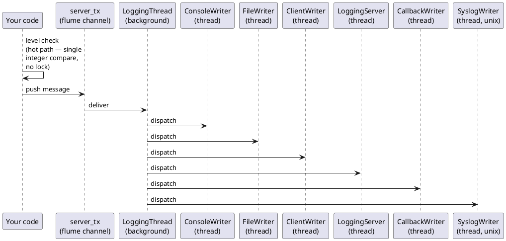

# cppfastlogging — Documentation

Modern C++17 wrapper around [`cfastlogging`](../cfastlogging), the C ABI bindings for the Rust [`fastlogging`](../fastlogging) library. It provides RAII classes in the `logging::` namespace for ergonomic, memory-safe usage while preserving the high-performance, asynchronous, multi-writer architecture of the underlying Rust library.

Messages are routed through an asynchronous background thread to one or more independent writers (console, file, network client/server, syslog, callback), so the hot path in your code stays a cheap level check followed by a channel send.

## Table of Contents

- [doc/LEVELS.md](doc/LEVELS.md) — Log-level constants and filtering semantics
- [doc/LOGGING.md](doc/LOGGING.md) — `logging::Logging` class — primary API
- [doc/LOGGER.md](doc/LOGGER.md) — `logging::Logger` class — per-thread/per-domain handles
- [doc/WRITERS.md](doc/WRITERS.md) — Writer configurations: console, file, callback, syslog
- [doc/NETWORK.md](doc/NETWORK.md) — Network logging — client and server writers
- [doc/CONFIG.md](doc/CONFIG.md) — Extended config (`ExtConfig`), config files, encryption
- [doc/ROOT.md](doc/ROOT.md) — Process-wide root logger (C-style functions)
- [doc/API.md](doc/API.md) — Concise API reference summary
- [doc/EXAMPLES.md](doc/EXAMPLES.md) — Full, runnable code examples

> The full guide (quick start, build, header overview, platform notes) lives in **[doc/README.md](doc/README.md)**.

## Quick Start

### Prerequisites

- Rust toolchain (`cargo`)
- `g++` supporting C++17
- `libcfastlogging.so` — built by `cargo build` in the parent workspace (see step 1)

### 1. Build the shared library

From the repository root:

```bash
cargo build -p cfastlogging            # debug
# or
cargo build -p cfastlogging --release  # release
```

### 2. Build and run the examples

```bash
cd cppfastlogging
make build-debug   # cargo build (debug), then compile all examples
# or
make build         # cargo build --release, then compile all examples
```

The produced binaries land in `cppfastlogging/bin/` (e.g. `./bin/console`).

### One-liner default logger

```cpp
#include "h/cppfastlogging.hpp"
using namespace logging;

int main() {
    Logging logging = Logging::Default();
    logging.info("Hello, cppfastlogging!");
    return 0;  // destructor calls shutdown(false) automatically
}
```

### Explicit console logger

```cpp
#include "h/cppfastlogging.hpp"
using namespace logging;

int main() {
    Logging logging(DEBUG, "myapp");
    logging.add_writer_config(ConsoleWriterConfig(DEBUG, true));
    logging.debug("starting up");
    logging.info("ready");
    return 0;
}
```

## Architecture

Log calls never touch I/O on the caller's thread. Each call performs a level check (the hot path), and if it passes, the message is handed to a flume-backed channel. A single `LoggingThread` running in the background drains that channel and dispatches to each writer's own thread.



Each writer runs in its own background thread and consumes messages from a bounded channel. The level check on the hot path is a single integer comparison with no locking.

## Important Notes

- **RAII lifecycle.** `logging::Logging` and `logging::Logger` are RAII classes: the destructor calls `shutdown(false)` automatically, so resources are released when the object goes out of scope.
- **Build order matters.** The wrapper links against `libcfastlogging.so` from the parent workspace — run `cargo build -p cfastlogging` (or `make build` in `cfastlogging/`) before building the C++ examples.
- **Syslog is Unix-only.** `SyslogWriterConfig` / `SyslogWriter` are available on **Unix** only. On **Windows** the equivalent is `eventlog`-backed and exposed under the same type names.
- **The `threads` example additionally links `-lpthread`.**
