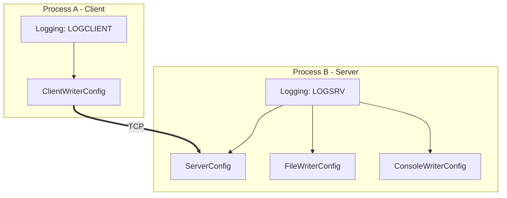

# cppfastlogging: Network Logging Documentation

## Overview

cppfastlogging supports distributed logging over TCP. The model is a classic **client/server** split:

- **Process A (the client)** runs a `Logging` instance with a `ClientWriterConfig`. Log messages produced in this process are sent over a TCP connection to a remote server.
- **Process B (the server)** runs a `Logging` instance with a `ServerConfig` writer, typically alongside other local writers such as `FileWriterConfig` and `ConsoleWriterConfig`. The server receives messages from one or more clients and dispatches them through its own local writers.

This lets you aggregate logs from many processes (or machines) into a single centralized logging server that writes to file/console/etc.

### Architecture Diagram



The client's `ClientWriterConfig` opens a TCP connection to the server's bound address/port. Messages flow over that connection into the server's dispatch thread, which fans them out to the server's local writers (file, console, etc.).

---

## `ClientWriterConfig`

Sends log messages to a remote logging server over TCP. Defined in `writer.hpp`:

```cpp
class ClientWriterConfig : public WriterConfig {
public:
    ClientWriterConfig(uint8_t level, const char *address,
                       const rust::KeyStruct *key = nullptr);
};
```

### Parameters

| Parameter | Type                    | Default | Description                                                                 |
|-----------|-------------------------|---------|-----------------------------------------------------------------------------|
| `level`   | `uint8_t`               | —       | Minimum log level for this writer.                                          |
| `address` | `const char *`          | —       | Remote server address in `"host:port"` form, e.g. `"127.0.0.1:5000"`.       |
| `key`     | `const rust::KeyStruct *` | `nullptr` | Optional encryption/authentication key. `nullptr` = unencrypted.          |

The `address` string is typically obtained from a server's `get_root_server_address_port()` (or one of the other server address query methods — see below), so that the client connects to the correct dynamically-assigned port.

---

## `ServerConfig`

Creates a network server writer that listens on a TCP port and receives log messages from remote clients. Defined in `writer.hpp`:

```cpp
class ServerConfig : public WriterConfig {
public:
    ServerConfig(uint8_t level, const char *address,
                 const rust::KeyStruct *key = nullptr);
};
```

### Parameters

| Parameter | Type                    | Default | Description                                                                 |
|-----------|-------------------------|---------|-----------------------------------------------------------------------------|
| `level`   | `uint8_t`               | —       | Minimum log level for this writer.                                          |
| `address` | `const char *`          | —       | Bind address, e.g. `"127.0.0.1"`.                                           |
| `key`     | `const rust::KeyStruct *` | `nullptr` | Optional encryption/authentication key. `nullptr` = unencrypted.          |

The **port is assigned dynamically** by the operating system. After the server writer is created and added to a `Logging` instance, the actual port can be discovered via the query methods below. This is why clients typically retrieve the address:port from the server programmatically rather than hard-coding a port.

---

## Adding a Server and Setting the Root Writer

A `ServerConfig` is added like any other writer via `add_writer_config`:

```cpp
ServerConfig srv(DEBUG, "127.0.0.1");
logging_server->add_writer_config(srv);
```

To make this server the **root writer** (so that it becomes the primary network distribution point and so that `get_root_server_address_port()` returns its address), use `set_root_writer_config`:

```cpp
logging_server->set_root_writer_config(srv);
```

`set_root_writer_config` accepts lvalue, pointer, and temporary overloads just like `add_writer_config`. The root writer must be a `ClientWriterConfig` or `ServerConfig`.

---

## Server Query Methods

All methods are on `logging::Logging` (see `logging.hpp`). They return information about the server writer(s) attached to the instance.

| Method                                        | Returns                          | Description                                                       |
|-----------------------------------------------|----------------------------------|-------------------------------------------------------------------|
| `get_server_config(uint32_t wid = 0)`         | `rust::ServerConfig *`           | Get the `rust::ServerConfig` for a specific writer id.            |
| `get_server_configs()`                        | `rust::ServerConfigs *`          | Get all server configs attached to this instance.                 |
| `get_root_server_address_port()`              | `const char *`                   | Address:port string of the root server writer (e.g. `"127.0.0.1:5000"`). |
| `get_server_addresses_ports()`                | `const rust::Cu32StringVec *`    | Map of writer id → address:port for all server writers.           |
| `get_server_addresses()`                      | `const rust::Cu32StringVec *`    | Map of writer id → address (no port) for all server writers.      |
| `get_server_ports()`                          | `const rust::Cu32u16Vec *`       | Map of writer id → port for all server writers.                   |
| `get_server_auth_key()`                       | `rust::KeyStruct *`              | The server's authentication key (for sharing with clients).       |

The `wid = 0` default for `get_server_config` selects the root writer.

### `rust::ServerConfig` and `rust::ServerConfigs`

Defined in `def.hpp`:

```cpp
struct ServerConfig {
    uint8_t     level;
    const char *address;
    uint16_t    port;
    KeyStruct  *key;
    const char *port_file;
};

struct ServerConfigs {
    uint32_t      cnt;
    uint32_t     *keys;     // writer ids, length cnt
    ServerConfig *values;   // configs, length cnt
};
```

### `Cu32StringVec_t` and `Cu32u16Vec_t`

These are the vector/map types returned by the address/port query methods. Defined in `def.hpp` with convenience aliases in the global namespace:

```cpp
struct Cu32StringVec { uint32_t cnt; uint32_t *keys; char **values; };
struct Cu32u16Vec    { uint32_t cnt; uint32_t *keys; uint16_t *values; };

using Cu32StringVec_t = rust::Cu32StringVec;
using Cu32u16Vec_t    = rust::Cu32u16Vec;
```

Both are parallel-array maps keyed by writer id (`keys[i]` is the writer id; `values[i]` is the corresponding value). Iterate by index `0..cnt-1`.

### Iterating Server Ports

```cpp
const Cu32u16Vec_t *ports = logging_server.get_server_ports();
if (ports) {
    for (uint32_t i = 0; i < ports->cnt; i++) {
        printf("ports->key[%u]=%u  ports->value[%u]=%u\n",
               i, ports->keys[i], i, ports->values[i]);
    }
}
```

### Iterating Server Addresses and Address:Port Pairs

```cpp
const Cu32StringVec_t *addresses = logging_server.get_server_addresses();
const Cu32StringVec_t *ap        = logging_server.get_server_addresses_ports();
if (ap) {
    for (uint32_t i = 0; i < ap->cnt; i++) {
        printf("wid=%u addr=%s\n", ap->keys[i], ap->values[i]);
    }
}
```

---

## Encryption

Network traffic between client and server can be authenticated and/or encrypted using a shared key. Both `ClientWriterConfig` and `ServerConfig` accept an optional `const rust::KeyStruct *key`.

### `rust::KeyStruct`

Defined in `def.hpp`:

```cpp
struct KeyStruct {
    EncryptionMethodEnum typ;  // NONE=0, AuthKey=1, AES=2
    uint32_t             len;
    const char          *key;
};
```

### `rust::EncryptionMethodEnum`

```cpp
enum class EncryptionMethodEnum : uint8_t {
    NONE    = 0,
    AuthKey = 1,
    AES     = 2
};
```

| Value     | Integer | Description                                                            |
|-----------|---------|------------------------------------------------------------------------|
| `NONE`    | 0       | No encryption.                                                         |
| `AuthKey` | 1       | Authentication only (shared-key handshake, plaintext payload).        |
| `AES`     | 2       | Authenticated + AES-encrypted payload.                                 |

### FFI Helpers for Creating Keys

Declared in `cppfastlogging.hpp`:

```cpp
rust::KeyStruct *create_key(rust::EncryptionMethodEnum typ, uint32_t len,
                            const uint8_t *key);
rust::KeyStruct *create_random_key(rust::EncryptionMethodEnum typ);
```

- `create_key` builds a `KeyStruct` from raw key bytes (`key`, length `len`) and a chosen encryption method.
- `create_random_key` builds a `KeyStruct` with a randomly generated key of the appropriate length for the chosen method.

### `set_encryption`

Encryption can also be (re)set on an existing network writer via `Logging::set_encryption`:

```cpp
int set_encryption(rust::WriterTypeEnum writer, const rust::KeyStruct *key);
```

`writer` selects the writer *type* to reconfigure (e.g. `rust::WriterTypeEnum::Client` or `rust::WriterTypeEnum::Server`). The return value is `0` on success, negative on error.

---

## `sync_all` — Ensuring Message Delivery Before Shutdown

Because logging is asynchronous, log messages may still be in flight when a process is about to exit. Always call `sync_all(timeout)` on both the client and the server before shutting down, to flush pending messages:

```cpp
logging_client->sync_all(1.0);  // flush client → server
logging_server->sync_all(1.0);  // flush server writers (file, console, ...)
```

`sync_all` returns `0` on success and a negative value on timeout/error. The timeout is in seconds (a `double`). See also the `sync(types, cnt, timeout)` overload for synchronizing only specific writer types.

---

## Full Unencrypted Client/Server Example

This example mirrors `examples/net_unencrypted_one_client.cpp`. The server sets up a console writer, a file writer, and a server writer. The client retrieves the server's address:port and auth key, creates a `ClientWriterConfig`, logs a message, then both sides sync and shut down.

```cpp
#include "h/cppfastlogging.hpp"
using namespace logging;

int main() {
    // ---- Server (Process B) ----
    Logging *logging_server = new Logging(DEBUG, "LOGSRV");
    logging_server->add_writer_config(ConsoleWriterConfig(DEBUG, true));
    logging_server->add_writer_config(FileWriterConfig(DEBUG, "/tmp/cfastlogging.log", 1024, 3));

    ServerConfig srv(DEBUG, "127.0.0.1");
    logging_server->add_writer_config(srv);
    logging_server->set_root_writer_config(srv);
    logging_server->sync_all(5.0);  // let the server bind and settle

    // ---- Client (Process A) ----
    const char *address_port = logging_server->get_root_server_address_port();
    rust::KeyStruct *key = logging_server->get_server_auth_key();

    Logging *logging_client = new Logging(DEBUG, "LOGCLIENT");
    logging_client->add_writer_config(ClientWriterConfig(DEBUG, address_port, key));
    logging_client->info("Info Message");

    // ---- Shutdown: flush both sides ----
    logging_client->sync_all(1.0);
    logging_server->sync_all(1.0);

    delete logging_client;
    delete logging_server;
    return 0;
}
```

Notes:

- In the unencrypted case, `get_server_auth_key()` may return a key with `typ == NONE`; passing it to `ClientWriterConfig` keeps the connection unencrypted.
- The `sync_all(5.0)` after adding the server writer gives the server time to bind and have a port assigned before the client queries `get_root_server_address_port()`.
- `set_root_writer_config(srv)` makes `srv` the root writer so that `get_root_server_address_port()` returns its address:port.

---

## See Also

- [WRITERS.md](WRITERS.md) — `ConsoleWriterConfig`, `FileWriterConfig`, `SyslogWriterConfig`, `CallbackWriterConfig`.
- [CONFIG.md](CONFIG.md) — `ExtConfig`, config files, and encryption helpers.
- Header files in `cppfastlogging/h/` (`writer.hpp`, `logging.hpp`, `def.hpp`, `cppfastlogging.hpp`).
