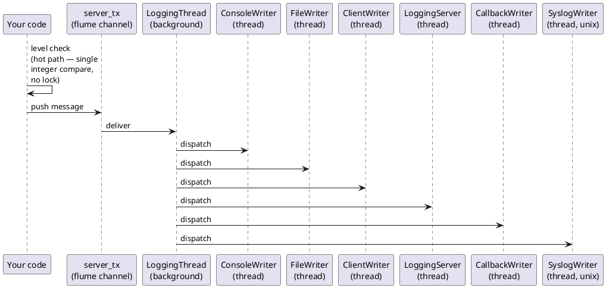

# cppfastlogging — Documentation

`cppfastlogging` is a modern C++17 wrapper around [`cfastlogging`](../cfastlogging),
the C ABI bindings for the Rust [`fastlogging`](../fastlogging) library. It provides
RAII classes in the `logging::` namespace for ergonomic, memory-safe usage while
preserving the high-performance, asynchronous, multi-writer architecture of the
underlying Rust library.

## Contents

| Document | Description |
|---|---|
| [LEVELS.md](LEVELS.md) | Log-level constants and filtering semantics |
| [LOGGING.md](LOGGING.md) | `logging::Logging` class — primary API |
| [LOGGER.md](LOGGER.md) | `logging::Logger` class — per-thread/per-domain handles |
| [WRITERS.md](WRITERS.md) | Writer configurations: console, file, callback, syslog |
| [NETWORK.md](NETWORK.md) | Network logging — client and server writers |
| [CONFIG.md](CONFIG.md) | Extended config (`ExtConfig`), config files, encryption |
| [ROOT.md](ROOT.md) | Process-wide root logger (C-style functions) |
| [API.md](API.md) | Concise API reference summary |
| [EXAMPLES.md](EXAMPLES.md) | Full, runnable code examples |

## Quick Start

### One-liner default logger

```cpp
#include "h/cppfastlogging.hpp"
using namespace logging;

int main() {
    Logging logging = Logging::Default();
    logging.info("Hello, cppfastlogging!");
    return 0;  // destructor calls shutdown(false) automatically
}
```

### Explicit console logger

```cpp
#include "h/cppfastlogging.hpp"
using namespace logging;

int main() {
    Logging logging(DEBUG, "myapp");
    logging.add_writer_config(ConsoleWriterConfig(DEBUG, true));
    logging.debug("starting up");
    logging.info("ready");
    return 0;
}
```

### Multiple writers via array constructor

```cpp
#include "h/cppfastlogging.hpp"
using namespace logging;

int main() {
    WriterConfig configs[] = {
        ConsoleWriterConfig(DEBUG, true),
        FileWriterConfig(DEBUG, "/tmp/app.log", 1024, 3)
    };
    Logging logging(DEBUG, "root", configs);
    logging.info("Logging to console and file");
    return 0;
}
```

## Architecture



Each writer runs in its own background thread and consumes messages from a bounded
channel.  The level check on the hot path is a single integer comparison with no locking.

## Build

The wrapper builds on top of `cfastlogging` (the C wrapper). From the
`cppfastlogging/` directory:

```sh
make build         # cargo build --release, then compile all examples
make build-debug   # cargo build (debug), then compile all examples
make clean         # remove bin/
make run           # alias for build-debug
```

Requirements:

- Rust toolchain (`cargo`)
- `g++` supporting C++17
- `libcfastlogging.so` (built by `cargo build` in the parent workspace)

Examples link with:

```sh
g++ -std=c++17 -I. -o ./bin/<name> ./examples/<name>.cpp \
    -L../target/release -l:libcfastlogging.so
```

The `threads` example additionally links `-lpthread`.

## Header File Overview

| Header | Contents |
|---|---|
| `h/def.hpp` | Log level constants, `rust::` enums, structs, opaque types |
| `h/writer.hpp` | Writer config RAII classes, `CompressionMethod` enum, C FFI declarations |
| `h/logger.hpp` | `logging::Logger` RAII class, C FFI declarations |
| `h/logging.hpp` | `logging::Logging` RAII class, `logging::ExtConfig`, `logging::MessageStruct`, C FFI declarations |
| `h/root.hpp` | Root logger C-style functions (no C++ wrapper) |
| `h/cppfastlogging.hpp` | Includes all headers + `create_key`/`create_random_key` FFI helpers |

## Platform Notes

`SyslogWriterConfig` / `SyslogWriter` are available on **Unix** only. On **Windows**
the equivalent is `eventlog`-backed and exposed under the same type names.
