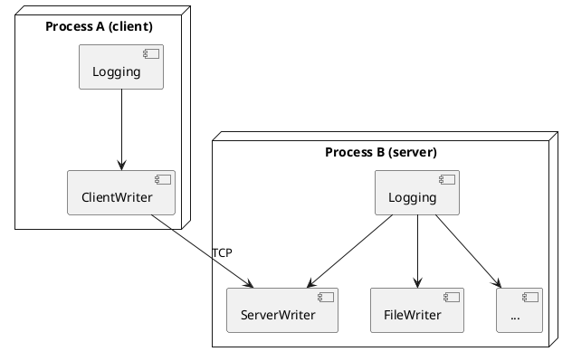

# Network Logging

`cxxfastlogging` supports forwarding log messages between processes over TCP.
A **server writer** (`WriterConfig::new_server`) listens for incoming
connections; a **client writer** (`WriterConfig::new_client`) connects to it.
Both support optional authentication-key or AES-256-GCM encryption.

## Overview



The server receives messages from clients and re-dispatches them to its own
writers (file, console, etc.).

## `EncryptionMethodEnum`

```cpp
enum class EncryptionMethodEnum : uint8_t {
    NONE    = 0,  // no encryption (plaintext + auth token still used internally)
    AuthKey = 1,  // HMAC key — authenticates without encrypting the payload
    AES     = 2,  // AES-256-GCM — authenticates and encrypts
};
```

A server's auth key is automatically shared with clients through
`Logging::get_server_auth_key()`.

## Server Side

Create a server writer config and install it as the *root writer* (wid = 0)
so the `LoggingServer` thread is actually started and begins listening:

```cpp
// Create server writer and add it to configs
rust::Vec<rust::Box<WriterConfig>> srv_configs;
srv_configs.push_back(WriterConfig::new_console(DEBUG, true));
// Server writer added after construction via set_root_writer_config:
auto srv = Logging::create(DEBUG, "SERVER", std::move(srv_configs));

srv->set_root_writer_config(
    WriterConfig::new_server(DEBUG, "127.0.0.1",
                              EncryptionMethodEnum::NONE, {}));
srv->sync_all(5.0);
```

After `set_root_writer_config`, `get_root_server_address_port()` returns the
bound `"ip:port"` string.

### `WriterConfig::new_server`

```cpp
static rust::Box<WriterConfig> new_server(
    uint8_t                    level,
    rust::Str                  address,  // "ip" or "ip:port"; 0 = OS-assigned
    EncryptionMethodEnum       key_type,
    rust::Slice<const uint8_t> key       // empty for NONE
);
```

## Client Side

```cpp
auto addr = srv->get_root_server_address_port();  // "127.0.0.1:NNNNN"
auto key  = srv->get_server_auth_key();           // rust::Vec<uint8_t>

rust::Vec<rust::Box<WriterConfig>> cli_configs;
cli_configs.push_back(WriterConfig::new_client(
    DEBUG, addr,
    EncryptionMethodEnum::AuthKey,
    rust::Slice<const uint8_t>(key.data(), key.size())));

auto cli = Logging::create(DEBUG, "CLIENT", std::move(cli_configs));
```

### `WriterConfig::new_client`

```cpp
static rust::Box<WriterConfig> new_client(
    uint8_t                    level,
    rust::Str                  address,  // "ip:port"
    EncryptionMethodEnum       key_type,
    rust::Slice<const uint8_t> key
);
```

## Full Example (unencrypted)

```cpp
#include "cxxfastlogging/h/fastlogging.h"
#include <thread>
#include <chrono>
#include <iostream>

int main() {
    // ── Server ───────────────────────────────────────────────────────
    rust::Vec<rust::Box<WriterConfig>> srv_configs;
    srv_configs.push_back(WriterConfig::new_console(DEBUG, true));
    srv_configs.push_back(WriterConfig::new_file(
        DEBUG, "/tmp/net.log", 0, 0, -1, -1, CompressionMethodEnum::Store));

    auto srv = Logging::create(DEBUG, "SERVER", std::move(srv_configs));
    srv->set_root_writer_config(
        WriterConfig::new_server(DEBUG, "127.0.0.1",
                                  EncryptionMethodEnum::NONE, {}));
    srv->sync_all(5.0);

    // ── Client ───────────────────────────────────────────────────────
    auto addr = srv->get_root_server_address_port();
    auto key  = srv->get_server_auth_key();

    rust::Vec<rust::Box<WriterConfig>> cli_configs;
    cli_configs.push_back(WriterConfig::new_client(
        DEBUG, addr,
        EncryptionMethodEnum::AuthKey,
        rust::Slice<const uint8_t>(key.data(), key.size())));

    auto cli = Logging::create(DEBUG, "CLIENT", std::move(cli_configs));

    cli->info("hello from client");
    srv->info("hello from server");

    cli->sync_all(1.0);
    srv->sync_all(1.0);
    std::this_thread::sleep_for(std::chrono::milliseconds(50));
    cli->shutdown(false);
    srv->shutdown(false);
    return 0;
}
```

## Querying Server State

```cpp
// "ip:port" of the root server writer, or "" if none
rust::String addr = log->get_root_server_address_port();

// All server writers: {id, "ip:port"}
auto addr_ports = log->get_server_addresses_ports();  // Vec<IdString>
for (auto& item : addr_ports)
    std::cout << item.id << " -> " << std::string(item.value) << "\n";

// Just addresses
auto addrs = log->get_server_addresses();   // Vec<IdString>

// Just ports
auto ports = log->get_server_ports();       // Vec<IdU16>
for (auto& item : ports)
    std::cout << item.id << " -> " << item.value << "\n";

// Auth key bytes
auto key = log->get_server_auth_key();      // Vec<uint8_t>
```

## Encryption

```cpp
// AuthKey: authentication only, payload is not encrypted
auto srv = WriterConfig::new_server(
    DEBUG, "127.0.0.1",
    EncryptionMethodEnum::AuthKey,
    rust::Slice<const uint8_t>(key_bytes.data(), key_bytes.size()));

// AES-256-GCM: full authenticated encryption
auto srv_enc = WriterConfig::new_server(
    DEBUG, "127.0.0.1",
    EncryptionMethodEnum::AES,
    rust::Slice<const uint8_t>(aes_key.data(), aes_key.size()));

// Reconfigure at runtime
log->set_encryption(
    wid, EncryptionMethodEnum::AES,
    rust::Slice<const uint8_t>(new_key.data(), new_key.size()));
```
