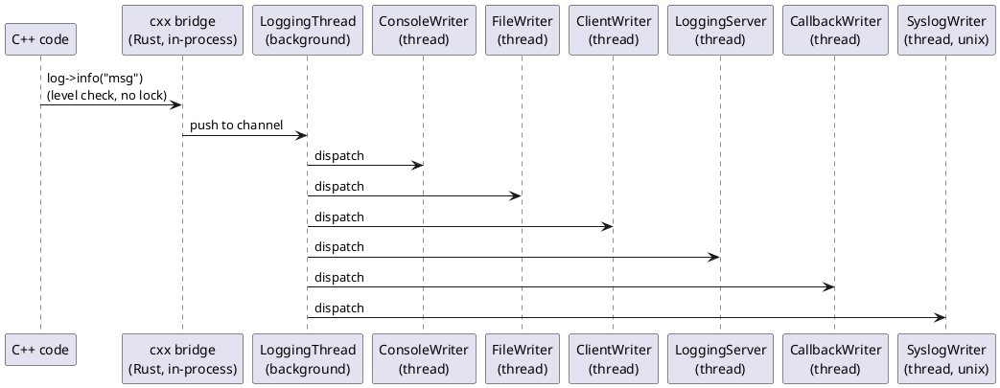

# cxxfastlogging — Documentation

`cxxfastlogging` is a type-safe C++ binding for the `fastlogging` Rust library,
generated via the [`cxx`](https://cxx.rs) crate.  It exposes the full
`fastlogging` API to C++ callers through opaque handle types and shared value
types, with errors mapped to C++ exceptions (`rust::Error`).

## Contents

| Document | Description |
|---|---|
| [LEVELS.md](LEVELS.md) | Log-level constants |
| [LOGGING.md](LOGGING.md) | `Logging` class — primary API |
| [LOGGER.md](LOGGER.md) | `Logger` class — per-domain handles |
| [WRITERS.md](WRITERS.md) | Writer factory functions: console, file, callback, syslog |
| [NETWORK.md](NETWORK.md) | Network logging — client and server writers |
| [CONFIG.md](CONFIG.md) | `ExtConfigFfi` and configuration helpers |
| [ROOT.md](ROOT.md) | Process-wide root logger (`root_*` free functions) |
| [EXAMPLES.md](EXAMPLES.md) | Full, buildable C++ examples |

## Building

### Prerequisites

- A C++17-capable compiler (`g++`, `clang++`).
- Rust toolchain with `cargo`.
- The `cxxfastlogging` crate built first:

```sh
cd fastlogging-rs
cargo build -p cxxfastlogging          # debug
# or
cargo build -p cxxfastlogging --release
```

This produces `target/debug/libcxxfastlogging.a` (static library) and a
generated header that you include in your C++ code.

### Including the Header

The stable include path is:

```cpp
#include "cxxfastlogging/src/lib.rs.h"
```

Or via the convenience forwarding header:

```cpp
#include "cxxfastlogging/h/fastlogging.h"
```

### Linking

```sh
# Locate the generated cxxbridge header directory:
CXXBRIDGE=$(find target/debug/build -maxdepth 4 -type d \
            -path '*/cxxfastlogging-*/out/cxxbridge/include' | head -1)

g++ -std=c++17 -I. -I"$CXXBRIDGE" \
    -o myapp myapp.cpp \
    -L target/debug -l:libcxxfastlogging.a \
    -lpthread -ldl -lm
```

See the `cxxfastlogging/Makefile` for a complete, ready-to-run build.

## Quick Start

```cpp
#include "cxxfastlogging/h/fastlogging.h"

int main() {
    // Default logger (console writer, NOTSET level)
    auto log = Logging::new_default();
    log->info("Hello from cxxfastlogging!");
    log->shutdown(false);
    return 0;
}
```

```cpp
#include "cxxfastlogging/h/fastlogging.h"

int main() {
    // Explicit console logger
    rust::Vec<rust::Box<WriterConfig>> configs;
    configs.push_back(WriterConfig::new_console(DEBUG, true));

    auto log = Logging::create(DEBUG, "myapp", std::move(configs));
    log->debug("starting up");
    log->info("ready");
    log->shutdown(false);
    return 0;
}
```

## Architecture



## Error Handling

Fallible bridge functions throw `rust::Error` on failure.  `rust::Error` is a
standard C++ exception that inherits from `std::exception`:

```cpp
try {
    auto log = Logging::create(DEBUG, "app", std::move(configs));
    log->info("hello");
} catch (const rust::Error& e) {
    std::cerr << "fastlogging error: " << e.what() << "\n";
}
```

## Platform Notes

`WriterConfig::new_syslog` is available on **Unix** only.  On **Windows** the
underlying `eventlog`-backed writer is exposed under the same name.

## Relationship to the Rust Crate

`cxxfastlogging` wraps `fastlogging` (Rust) directly — no C intermediate layer.
Types shared by value across the FFI boundary (`EncryptionMethodEnum`,
`CompressionMethodEnum`, `MessageStructEnum`, `LevelSymsEnum`, `WriterTypeTag`,
`ExtConfigFfi`, `ServerConfigInfo`, `IdString`, `IdU16`) are declared as
`struct`/`enum class` in the generated C++ header and can be used like ordinary
C++ types.  Opaque handle types (`Logging`, `Logger`, `WriterConfig`) are
accessible only through `rust::Box<T>` pointers returned by factory functions.
