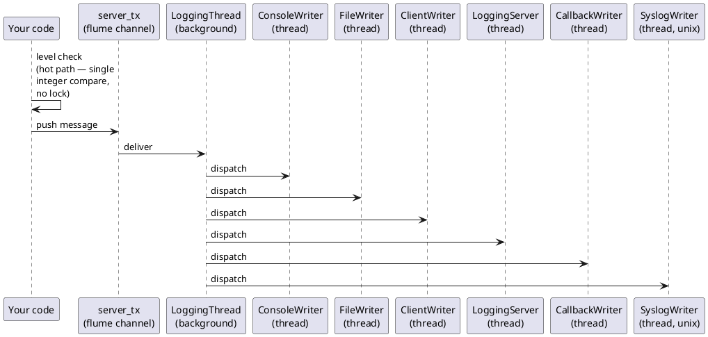

# fastlogging — Documentation

`fastlogging` is a high-performance, thread-safe structured logging library for Rust. It routes messages through an asynchronous background thread to one or more independent *writers* (console, file, network client/server, syslog, callback), keeping your hot path free of blocking I/O — each call is a cheap level check followed by a channel send.

## Table of Contents

- [doc/LEVELS.md](doc/LEVELS.md) — Log-level constants and helper functions
- [doc/LOGGING.md](doc/LOGGING.md) — `Logging` struct — primary API
- [doc/LOGGER.md](doc/LOGGER.md) — `Logger` struct — per-thread/per-domain handles
- [doc/WRITERS.md](doc/WRITERS.md) — Writer configurations: console, file, callback, syslog
- [doc/NETWORK.md](doc/NETWORK.md) — Network logging — client and server writers
- [doc/CONFIG.md](doc/CONFIG.md) — Extended config and file-based configuration
- [doc/ROOT.md](doc/ROOT.md) — Process-wide root logger (`ROOT_LOGGER`)
- [doc/EXAMPLES.md](doc/EXAMPLES.md) — Full, runnable code examples

> The full guide (quick start, architecture, features, platform notes) lives in **[doc/README.md](doc/README.md)**.

## Quick Start

Add to `Cargo.toml`:

```toml
[dependencies]
fastlogging = "0.8"
```

### One-liner default logger

```rust
use fastlogging::{logging_new_default, LoggingError};

fn main() -> Result<(), LoggingError> {
    let mut log = logging_new_default()?;
    log.info("Hello, fastlogging!")?;
    log.shutdown(false)?;
    Ok(())
}
```

### Explicit console logger

```rust
use fastlogging::{ConsoleWriterConfig, DEBUG, Logging, LoggingError};

fn main() -> Result<(), LoggingError> {
    let mut log = Logging::new(
        DEBUG,
        "myapp",
        Some(vec![ConsoleWriterConfig::new(DEBUG, true).into()]),
        None,
        None,
    )?;
    log.debug("starting up")?;
    log.info("ready")?;
    log.shutdown(false)?;
    Ok(())
}
```

## Architecture

Log calls never touch I/O on the caller's thread. Each call performs a level check (the hot path), and if it passes, the message is handed to a flume-backed channel. A single `LoggingThread` running in the background drains that channel and dispatches to each writer's own thread.



Each writer runs in its own background thread and consumes messages from a bounded channel. The level check on the hot path is a single integer comparison with no locking.

## Crate Features

| Feature | Default | Description |
|---|---|---|
| `config_json` | ✔ | Save / load configuration as JSON |
| `config_yaml` | ✔ | Save / load configuration as YAML |
| `config_xml`  | ✔ | Save / load configuration as XML  |

Disable all three to get a dependency-light build:

```toml
fastlogging = { version = "0.8", default-features = false }
```

## Platform Notes

- `SyslogWriter` / `SyslogWriterConfig` are available on **Unix** only (`#[cfg(target_family = "unix")]`). On **Windows** the equivalent is `eventlog`-backed and exposed under the same type names.

## Language Bindings

The Rust core is wrapped for other languages in sibling crates/directories:

| Binding | Layer | Repository dir |
|---|---|---|
| C | raw `extern "C"` ABI (cbindgen header) | [`cfastlogging`](../cfastlogging) |
| C++ (cxx) | type-safe `cxx` bridge | [`cxxfastlogging`](../cxxfastlogging) |
| C++ (wrapper) | C++17 RAII over the C ABI | [`cppfastlogging`](../cppfastlogging) |
| Go | cgo wrapper | [`gofastlogging`](../gofastlogging) |
| Python | PyO3/maturin | [`pyfastlogging`](../pyfastlogging) |
| Java (JNI) | JNI bindings | [`jfastlogging-jni`](../jfastlogging-jni) |
| Java (FFM) | Foreign Function & Memory API | [`jfastlogging-ffm`](../jfastlogging-ffm) |
