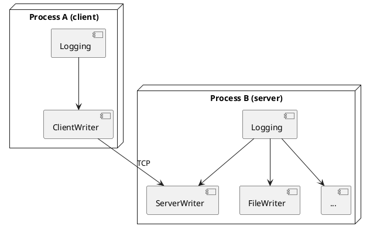

# Network Logging

`fastlogging` supports forwarding log messages over TCP.  A **server** (`ServerConfig`)
listens for incoming connections; a **client** (`ClientWriterConfig`) connects to a
server.  Both support optional authentication-key or AES-256-GCM encryption.

## Overview



The server receives messages and re-dispatches them to its own writers (file, console,
etc.).  Both processes are ordinary `Logging` instances; the network transport is just
another writer.

## `EncryptionMethod`

```rust
pub enum EncryptionMethod {
    NONE,
    AuthKey(Vec<u8>),   // HMAC key — authenticates the connection
    AES(Vec<u8>),       // AES-256-GCM — authenticates and encrypts
}
```

A server's auth key is automatically shared with new clients through
`Logging::get_server_auth_key()`.

## Server: `ServerConfig`

```rust
pub fn new<S: Into<String>>(
    level:   u8,
    address: S,            // "ip" or "ip:port" (port 0 = OS-assigned)
    key:     EncryptionMethod,
) -> Self
```

| Field | Description |
|---|---|
| `level` | Minimum message level forwarded from clients |
| `address` | Bind address.  Omit port for OS-assigned. |
| `port` | Parsed from `address`; 0 means OS-assigned |
| `key` | Encryption / authentication method |
| `port_file` | Temp file written by `ROOT_LOGGER` for parent-process detection |

### Setting a Root Writer

A server must be installed as the *root writer* so the internal `LoggingServer`
thread is actually started and listening:

```rust
logging_server.set_root_writer_config(
    &ServerConfig::new(DEBUG, "127.0.0.1", EncryptionMethod::NONE).into()
)?;
```

After this call, `get_root_server_address_port()` returns the bound `"ip:port"` string.

## Client: `ClientWriterConfig`

```rust
pub fn new<S: Into<String>>(
    level:   u8,
    address: S,            // "ip:port" of the target server
    key:     EncryptionMethod,
) -> Self
```

```rust
let auth_key = logging_server.get_server_auth_key();
let mut logging_client = Logging::new(
    DEBUG, "client",
    Some(vec![
        ClientWriterConfig::new(
            DEBUG,
            logging_server.get_root_server_address_port().unwrap(),
            auth_key,
        ).into(),
    ]),
    None, None,
)?;
```

## Full Example (unencrypted)

```rust
use std::{thread, time::Duration};
use fastlogging::{
    ClientWriterConfig, ConsoleWriterConfig, DEBUG, EncryptionMethod,
    FileWriterConfig, Logging, LoggingError, ServerConfig,
};
use std::path::PathBuf;

fn main() -> Result<(), LoggingError> {
    // ── Server ──────────────────────────────────────────────────────
    let mut srv = Logging::new(
        DEBUG, "SERVER",
        Some(vec![
            ConsoleWriterConfig::new(DEBUG, true).into(),
            FileWriterConfig::new(DEBUG, PathBuf::from("/tmp/net.log"),
                0, 0, None, None, None)?.into(),
        ]),
        None, None,
    )?;
    srv.set_root_writer_config(
        &ServerConfig::new(DEBUG, "127.0.0.1", EncryptionMethod::NONE).into()
    )?;
    srv.sync_all(5.0)?;

    // ── Client ──────────────────────────────────────────────────────
    let mut cli = Logging::new(
        DEBUG, "CLIENT",
        Some(vec![
            ClientWriterConfig::new(
                DEBUG,
                srv.get_root_server_address_port().unwrap(),
                srv.get_server_auth_key(),
            ).into(),
        ]),
        None, None,
    )?;

    cli.info("hello from client")?;
    srv.info("hello from server")?;

    cli.sync_all(1.0)?;
    srv.sync_all(1.0)?;
    thread::sleep(Duration::from_millis(50));
    cli.shutdown(false)?;
    srv.shutdown(false)?;
    Ok(())
}
```

## Querying Server State

```rust
// Address + port string of the root server writer
let addr: Option<String> = logging.get_root_server_address_port();

// All server writers: wid → "ip:port"
let map: HashMap<usize, String> = logging.get_server_addresses_ports();

// All server addresses (without port)
let addrs: HashMap<usize, String> = logging.get_server_addresses();

// All server ports
let ports: HashMap<usize, u16> = logging.get_server_ports();

// Authentication key used by the internal server
let key: EncryptionMethod = logging.get_server_auth_key();
```

## Encryption

```rust
// AuthKey: lightweight authentication, no payload encryption
ServerConfig::new(DEBUG, "127.0.0.1", EncryptionMethod::AuthKey(key_bytes))

// AES-256-GCM: full authenticated encryption
ServerConfig::new(DEBUG, "127.0.0.1", EncryptionMethod::AES(aes_key_bytes))
```

Reconfigure encryption at runtime:

```rust
logging.set_encryption(wid, EncryptionMethod::AES(new_key))?;
```
