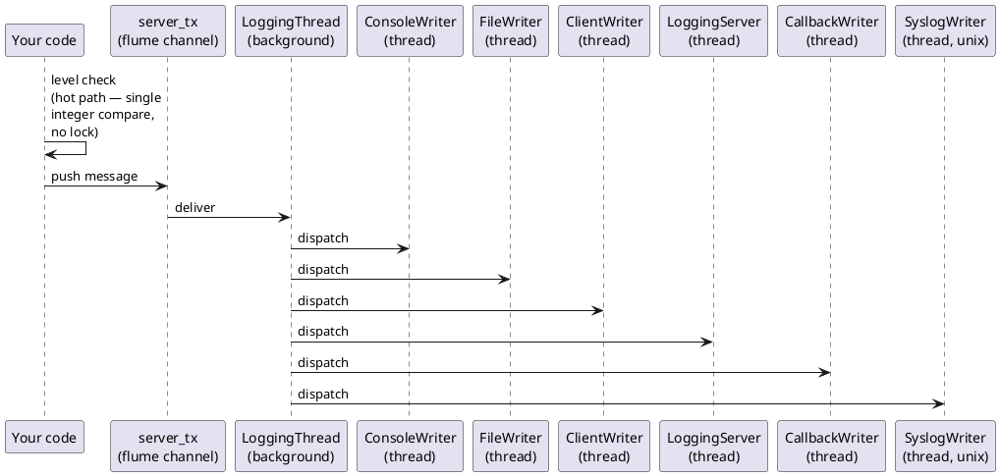

# fastlogging — Documentation

`fastlogging` is a high-performance, thread-safe structured logging library for Rust.
It routes messages through an asynchronous background thread to one or more independent
*writers*, keeping your hot path free of blocking I/O.

## Contents

| Document | Description |
|---|---|
| [LEVELS.md](LEVELS.md) | Log-level constants and helper functions |
| [LOGGING.md](LOGGING.md) | `Logging` struct — primary API |
| [LOGGER.md](LOGGER.md) | `Logger` struct — per-thread/per-domain handles |
| [WRITERS.md](WRITERS.md) | Writer configurations: console, file, callback, syslog |
| [NETWORK.md](NETWORK.md) | Network logging — client and server writers |
| [CONFIG.md](CONFIG.md) | Extended config and file-based configuration |
| [ROOT.md](ROOT.md) | Process-wide root logger (`ROOT_LOGGER`) |
| [EXAMPLES.md](EXAMPLES.md) | Full, runnable code examples |

## Quick Start

Add to `Cargo.toml`:

```toml
[dependencies]
fastlogging = "0.3"
```

## One-liner default logger

```rust
use fastlogging::{logging_new_default, LoggingError};

fn main() -> Result<(), LoggingError> {
    let mut log = logging_new_default()?;
    log.info("Hello, fastlogging!")?;
    log.shutdown(false)?;
    Ok(())
}
```

## Explicit console logger

```rust
use fastlogging::{ConsoleWriterConfig, DEBUG, Logging, LoggingError};

fn main() -> Result<(), LoggingError> {
    let mut log = Logging::new(
        DEBUG,
        "myapp",
        Some(vec![ConsoleWriterConfig::new(DEBUG, true).into()]),
        None,
        None,
    )?;
    log.debug("starting up")?;
    log.info("ready")?;
    log.shutdown(false)?;
    Ok(())
}
```

## Architecture



Each writer runs in its own background thread and consumes messages from a bounded
channel.  The level check on the hot path is a single integer comparison with no locking.

## Crate Features

| Feature | Default | Description |
|---|---|---|
| `config_json` | ✔ | Save / load configuration as JSON |
| `config_yaml` | ✔ | Save / load configuration as YAML |
| `config_xml`  | ✔ | Save / load configuration as XML  |

Disable all three to get a dependency-light build:

```toml
fastlogging = { version = "0.3", default-features = false }
```

## Platform Notes

`SyslogWriter` / `SyslogWriterConfig` are available on **Unix** only
(`#[cfg(target_family = "unix")]`).  On **Windows** the equivalent is
`eventlog`-backed and exposed under the same type names.
