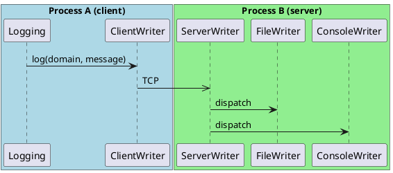

# Network Logging

fastlogging supports network logging via a client-server architecture. A `Logging` instance can act as a server (listening for connections) by setting a `ServerConfig` as its root writer config, and another `Logging` instance can act as a client by including a `ClientWriterConfig` in its writers.

## Server setup

```go
func ServerConfigNew(level uint8, address string, key *fl.KeyStruct) *fl.WriterConfigEnum
```

- `level` — log level filter
- `address` — listening IP address (e.g. `"127.0.0.1"`)
- `key` — encryption key pointer, or `nil` for no encryption

The server binds to the given address and accepts TCP connections from clients. Because the OS assigns the actual port when the address does not include one, retrieve the bound address:port from the logger after startup with `GetRootServerAddressPort()`.

### Example

```go
package main

import (
    "fmt"

    fl "gofastlogging/fastlogging"
    "gofastlogging/fastlogging/logging"
    "gofastlogging/fastlogging/writer"
)

func main() {
    // Writers that the server dispatches received messages to.
    console := writer.ConsoleWriterConfigNew(fl.DEBUG, true)
    file := writer.FileWriterConfigNew(
        fl.DEBUG,
        "/tmp/server.log",
        1024*1024,
        5,
        -1,
        -1,
        fl.Store,
    )

    writers := []fl.WriterConfigEnum{
        *console,
        *file,
    }

    loggingServer := logging.New(writers, fl.DEBUG)

    // Create the server config. nil key => no encryption.
    server := writer.ServerConfigNew(fl.DEBUG, "127.0.0.1", nil)
    if server == nil {
        panic("failed to create server config")
    }

    // Install it as the root writer config.
    loggingServer.SetRootWriterConfig(*server)

    // Sync to ensure the server is listening before querying the bound address.
    loggingServer.SyncAll(5.0)

    addr := loggingServer.GetRootServerAddressPort()
    fmt.Println("server listening on", addr)

    defer loggingServer.SyncAll(1.0)
    // ... accept clients and log ...
}
```

## Client setup

```go
func ClientWriterConfigNew(level uint8, address string, key *fl.KeyStruct) *fl.WriterConfigEnum
```

- `level` — log level filter
- `address` — target address:port (e.g. `"127.0.0.1:12345"`)
- `key` — encryption key pointer, or `nil`

### Example

```go
package main

import (
    fl "gofastlogging/fastlogging"
    "gofastlogging/fastlogging/logging"
    "gofastlogging/fastlogging/writer"
)

func main() {
    // Point the client at the server's bound address:port.
    client := writer.ClientWriterConfigNew(fl.DEBUG, "127.0.0.1:12345", nil)
    if client == nil {
        panic("failed to create client writer config")
    }

    writers := []fl.WriterConfigEnum{
        *client,
    }

    logger := logging.New(writers, fl.DEBUG)

    logger.Infof("Client", "hello over the network")

    // Flush before shutdown so messages reach the server.
    logger.SyncAll(1.0)
}
```

## Encrypted communication

To enable encryption, create a key and pass it to both the server and the client. Use one of the encryption methods defined on `fl.EncryptionMethod`:

- `fl.NONE` — no encryption
- `fl.AuthKey` — authentication only
- `fl.AES` — full AES encryption

Keys are created with `fl.CreateKey` or `fl.CreateRandomKey`:

```go
key := fl.CreateRandomKey(fl.AES)
// or
key := fl.CreateKey(fl.AES, keyBytes)
```

> **IMPORTANT — do not reuse a `fl.KeyStruct` after handing it to a writer config factory.** The key value is consumed by Rust when the writer config is created. Passing the same `fl.KeyStruct` value to a second factory (for example, to the client) will not work as expected.
>
> Instead, retrieve the key from the running server via `GetServerAuthKey()` and pass that key to the client.

### Example

```go
package main

import (
    "fmt"

    fl "gofastlogging/fastlogging"
    "gofastlogging/fastlogging/logging"
    "gofastlogging/fastlogging/writer"
)

func main() {
    // --- Server ---
    console := writer.ConsoleWriterConfigNew(fl.DEBUG, true)
    file := writer.FileWriterConfigNew(
        fl.DEBUG,
        "/tmp/server.log",
        1024*1024,
        5,
        -1,
        -1,
        fl.Store,
    )

    loggingServer := logging.New([]fl.WriterConfigEnum{*console, *file}, fl.DEBUG)

    // Create a random AES key for the server.
    serverKey := fl.CreateRandomKey(fl.AES)

    // The factory consumes the key value. Pass it by pointer.
    server := writer.ServerConfigNew(fl.DEBUG, "127.0.0.1", &serverKey)
    loggingServer.SetRootWriterConfig(*server)
    loggingServer.SyncAll(5.0)

    addr := loggingServer.GetRootServerAddressPort()
    fmt.Println("server listening on", addr)

    // Retrieve the auth key from the running server and use it for the client.
    authKey := loggingServer.GetServerAuthKey()

    // --- Client ---
    client := writer.ClientWriterConfigNew(fl.DEBUG, addr, &authKey)
    if client == nil {
        panic("failed to create client writer config")
    }

    logger := logging.New([]fl.WriterConfigEnum{*client}, fl.DEBUG)
    logger.Infof("Client", "encrypted hello")

    logger.SyncAll(1.0)
    loggingServer.SyncAll(1.0)
}
```

## Key types

The encryption method passed to `fl.CreateRandomKey` / `fl.CreateKey` controls how the network traffic is protected:

| Method        | `fl.EncryptionMethod` | Behavior                          |
|---------------|------------------------|-----------------------------------|
| None          | `fl.NONE`              | No encryption                     |
| Auth only     | `fl.AuthKey`           | Authentication only               |
| Full encryption | `fl.AES`             | Full AES encryption               |

## Architecture

The following diagram shows a typical two-process deployment: Process A runs a `Logging` instance with a `ClientWriter` that forwards messages over TCP to Process B, whose `Logging` instance uses a `ServerWriter` as its root writer config and dispatches received messages to a `FileWriter` and a `ConsoleWriter`.



## Server config query methods

The `Logging` struct exposes several methods for inspecting the server configuration after a `ServerConfig` has been installed as the root writer config:

| Method                              | Description                                                        |
|-------------------------------------|--------------------------------------------------------------------|
| `GetServerConfig()`                 | Returns the root server config.                                    |
| `GetServerConfigs()`                | Returns all server configs.                                        |
| `GetRootServerAddressPort()`        | Returns the bound address:port of the root server.                 |
| `GetRootServerAddressesPorts()`     | Returns the bound address:port pairs of the root server.           |
| `GetRootServerAddresses()`          | Returns the bound addresses of the root server.                    |
| `GetRootServerPorts()`              | Returns the bound ports of the root server.                        |
| `GetServerAuthKey()`                | Returns the server's auth key for handing to clients.              |

See `LOGGING.md` for full signatures and return types.
