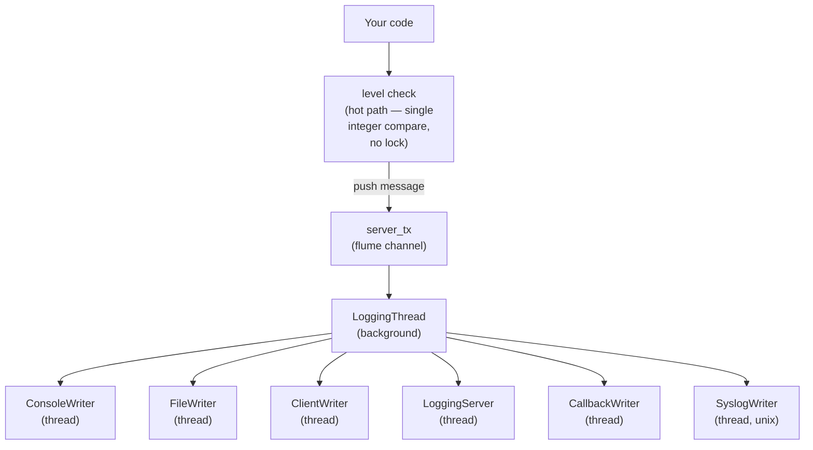

# gofastlogging — Documentation

Go bindings for the [fastlogging](https://github.com/brummer1024/fastlogging-rs) Rust logging library via cgo. Messages are routed through an asynchronous background thread to one or more independent writers (console, file, network client/server, syslog, callback), so the hot path in your code stays a cheap level check followed by a channel send.

## Contents

- [DEF.md](DEF.md) — Top-level definitions: log levels, enums, type wrappers, key creation
- [LEVELS.md](LEVELS.md) — Log levels, symbols, and filtering semantics
- [LOGGING.md](LOGGING.md) — The `Logging` struct (primary logger instance)
- [LOGGER.md](LOGGER.md) — The `Logger` struct (per-thread / per-domain handles)
- [WRITERS.md](WRITERS.md) — Writer configuration factories and writer types
- [NETWORK.md](NETWORK.md) — Network client/server writers and encryption
- [CONFIG.md](CONFIG.md) — Configuration files, extended formatting, runtime config queries
- [ROOT.md](ROOT.md) — Root logger (process-global) functions
- [EXAMPLES.md](EXAMPLES.md) — Runnable examples

## Quick Start

The `gofastlogging` crate is **not** part of the Cargo workspace. It is built with `make` from the `gofastlogging/` directory, after producing the C shared library from the `cfastlogging` package.

### 1. Build the C library

From the repository root:

```bash
cargo build -p cfastlogging            # debug  -> target/debug/libcfastlogging.so
# or
cargo build -p cfastlogging --release  # release -> target/release/libcfastlogging.so
```

### 2. Build the Go wrapper and examples

```bash
cd gofastlogging
make build-debug   # uses ../target/debug/libcfastlogging.so
# or
make build         # uses ../target/release/libcfastlogging.so
```

The Makefile copies the shared library from `../target/{debug,release}/libcfastlogging.so` into `gofastlogging/lib/`, then runs `go build` with `-ldflags="-r $(ROOT_DIR)lib"` so the runtime linker can find `libcfastlogging.so` next to the produced binaries in `gofastlogging/bin/`.

### 3. Minimal console example

```go
package main

import (
    "gofastlogging/fastlogging/logging"
)

func main() {
    logger, err := logging.Default()
    if err != nil {
        panic(err)
    }
    defer logger.Shutdown(false)

    logger.Info("Hello from gofastlogging")
}
```

## One-liner default logger

The fastest way to get a working logger is `logging.Default()`, which returns a `*Logging` configured with the library defaults:

```go
package main

import "gofastlogging/fastlogging/logging"

func main() {
    logger, err := logging.Default()
    if err != nil {
        panic(err)
    }
    defer logger.Shutdown(false)

    logger.Info("Hello from gofastlogging")
}
```

`logging.Default()` returns `(*Logging, error)`. Call `Shutdown(false)` (or `Shutdown(true)` to flush) when you are done.

## Explicit console logger

For control over the level, colors, and writer set, build writer configs with the `writer` package and pass them to `logging.New`:

```go
package main

import (
    fl "gofastlogging/fastlogging"
    "gofastlogging/fastlogging/logging"
    "gofastlogging/fastlogging/writer"
)

func main() {
    console := writer.ConsoleWriterConfigNew(fl.DEBUG, true)
    if console == nil {
        panic("failed to create console writer")
    }
    logger := logging.New(
        fl.DEBUG,                        // root level
        nil,                             // domain (optional *string)
        []fl.WriterConfigEnum{*console}, // writers (dereference the pointer!)
        nil,                             // extConfig (optional *fl.ExtConfig)
        nil,                             // configPath (optional *string)
    )
    if logger == nil {
        panic("failed to create logger")
    }
    defer logger.Shutdown(false)

    logger.Info("Hello from gofastlogging")
}
```

Notes on this pattern:

- `writer.ConsoleWriterConfigNew` (and the other writer factory functions) return `*fl.WriterConfigEnum`. When building a `[]fl.WriterConfigEnum` slice for `logging.New`, **dereference each element with `*`**.
- `logging.New` returns `*Logging` (no error value); it returns `nil` if the underlying C constructor fails.
- Optional string parameters use `*string`; pass `nil` to leave them unset.

## Architecture

Log calls never touch I/O on the caller's goroutine. Each call performs a level check (the hot path), and if it passes, the message is handed to a flume-backed channel (`server_tx`). A single `LoggingThread` running in the background drains that channel and dispatches to each writer's own thread.



Because the channel send is the only work done on the caller's goroutine, logging stays cheap even when writers are slow (network, disk, syslog).

## Package Layout

The Go wrapper is split across four packages. Import paths are rooted at the `gofastlogging` module:

| Package | Import path | Typical alias | Responsibility |
| --- | --- | --- | --- |
| `fastlogging` | `gofastlogging/fastlogging` | `fl` | Log-level constants, enums (`LevelSymbol`, `FileType`, `MessageStruct`, `EncryptionMethod`, `CompressionMethod`), type wrappers (`WriterConfigEnum`, `Key`, `ExtConfig`, ...), root logger functions, and key creation (`CreateKey`, `CreateRandomKey`). |
| `logging` | `gofastlogging/fastlogging/logging` | `logging` | The `Logging` struct — the primary logger instance. `logging.New` and `logging.Default` construct it; methods log messages and manage writers, levels, domain, sync, rotation, and config. |
| `logger` | `gofastlogging/fastlogging/logger` | `logger` | The `Logger` struct — lightweight per-thread / per-domain handles attached to a `Logging` instance. |
| `writer` | `gofastlogging/fastlogging/writer` | `writer` | Writer configuration factory functions: `ConsoleWriterConfigNew`, `FileWriterConfigNew`, `ClientWriterConfigNew`, `ServerConfigNew`, `SyslogWriterConfigNew`, `CallbackWriterConfigNew`. |

A typical import block:

```go
import (
    fl "gofastlogging/fastlogging"
    "gofastlogging/fastlogging/logging"
    "gofastlogging/fastlogging/writer"
)
```

## Important Notes

- **Writer factory functions return `*fl.WriterConfigEnum`.** When assembling a `[]fl.WriterConfigEnum` slice for `logging.New` (or `AddWriterConfigs`), dereference each pointer with `*`, e.g. `[]fl.WriterConfigEnum{*console, *file}`. Passing the pointers directly is a type error.
- **`logging.New` returns `*Logging` (no error).** It returns `nil` if the underlying C constructor fails, so check for `nil` if you want to fail loudly. `logging.Default()` returns `(*Logging, error)`.
- **Optional strings use `*string`.** Pass `nil` for "not set" rather than an empty string when the distinction matters (e.g. `domain`, `configPath`).
- **Callback writer is not yet implemented.** `writer.CallbackWriterConfigNew` exists for API symmetry but currently returns an error. The other writer types are functional.
- **Cross-package type wrappers use `unsafe.Pointer` fields.** This is intentional: cgo generates a distinct, non-interchangeable Go type per package for each C type, even when two `import "C"` blocks include the same header. Using `unsafe.Pointer` lets `WriterConfigEnum`, `Key`, `ExtConfig`, etc. flow between the `fastlogging`, `logging`, `logger`, and `writer` packages. See `DEF.md` for the full list.
- **Build order matters.** The Makefile expects `libcfastlogging.so` to already exist in `../target/debug` (or `../target/release`). Run `cargo build -p cfastlogging` first, then `make build-debug` / `make build`.
