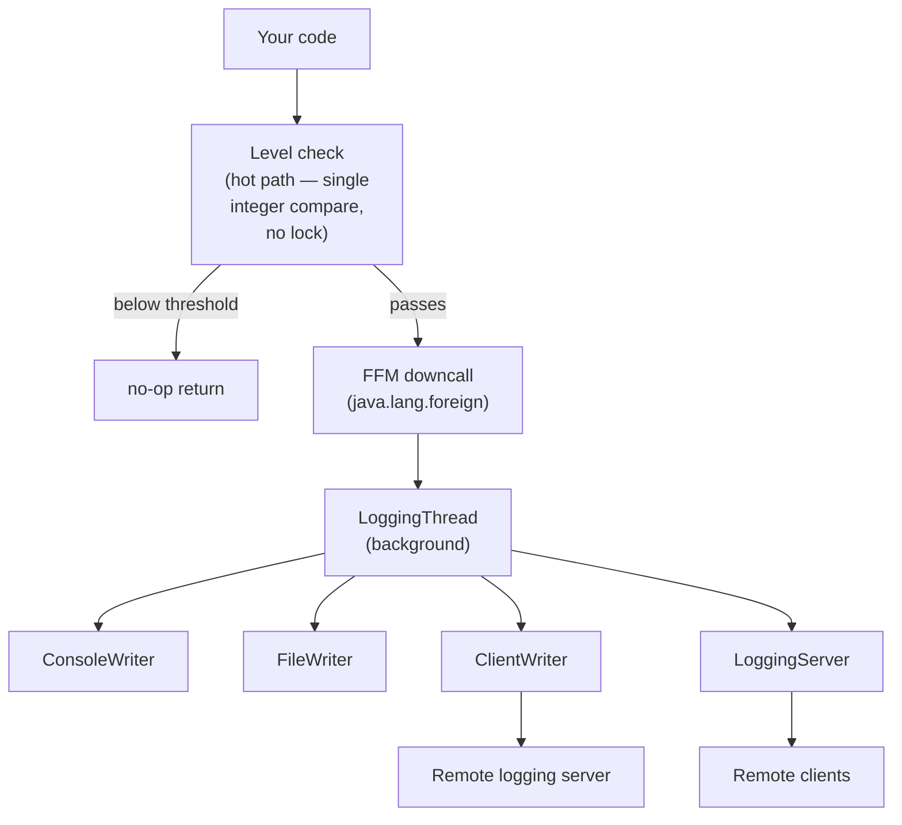

# jfastlogging (FFM) — Documentation

Java bindings for the [fastlogging](https://github.com/brmmm3/fastlogging-rs/tree/master/fastlogging) Rust logging library, built on the Java **Foreign Function & Memory (FFM) API** (`java.lang.foreign`, finalized in JDK 22). Unlike the [JNI variant](../jfastlogging-jni), no JNI glue code is needed — the bindings talk to the native library directly through `Linker` and `SymbolLookup`.

Messages are routed through an asynchronous background thread to one or more independent writers (console, file, network client/server), keeping the hot path cheap.

## Table of Contents

- [DEF.md](doc/DEF.md) — Constants, enums, and config class definitions
- [LEVELS.md](doc/LEVELS.md) — Log level reference
- [LOGGING.md](doc/LOGGING.md) — The `Logging` class (main entry point)
- [LOGGER.md](doc/LOGGER.md) — The `Logger` inner class
- [WRITERS.md](doc/WRITERS.md) — Writer configuration classes
- [NETWORK.md](doc/NETWORK.md) — Client and server networking
- [CONFIG.md](doc/CONFIG.md) — Extended formatting configuration
- [EXAMPLES.md](doc/EXAMPLES.md) — End-to-end usage examples

## Quick Start

> **Requirements:** JDK 25 (the Maven project compiles with `source`/`target` 25 and the bindings use the finalized FFM API) and a recent Maven 3.9+.

#### 1. Build the native shared library

```sh
cargo build --release
```

Run from the repo root or from `jfastlogging-ffm/`. This produces the `cdylib` `libjfastlogging.so` (Rust crate `jfastlogging-ffm`).

#### 2. Copy the library into the Maven project's `lib/` directory

```sh
cp target/release/libjfastlogging.so jfastlogging-ffm/FastLogging/lib/
```

The Maven tests load the library from `FastLogging/lib/` via `-Djava.library.path=${project.basedir}/lib` (already configured in the POM).

#### 3. Build and test the Maven project

```sh
mvn clean test
```

Run from `jfastlogging-ffm/FastLogging/`. The Maven build compiles the Java sources, runs the JUnit test suite and packages the JAR.

The Java source lives at `jfastlogging-ffm/org/logging/FastLogging.java`; the Maven project lives at `jfastlogging-ffm/FastLogging/`.

### Minimal Console Example

```java
import org.logging.FastLogging;
import org.logging.FastLogging.ConsoleWriterConfig;
import org.logging.FastLogging.Logging;

public class Main {
    public static void main(String[] args) {
        ConsoleWriterConfig console = new ConsoleWriterConfig(FastLogging.DEBUG, true);
        Logging logging = new Logging(FastLogging.DEBUG, "root", console);
        logging.info("Hello from jfastlogging (FFM)");
        logging.shutdown();
    }
}
```

## Architecture

The FFM bindings resolve the native entry points once at class-load time via `Linker.nativeLinker()` and `SymbolLookup.loaderLookup()` (after `System.loadLibrary("jfastlogging")`). All log calls on the hot path do a cheap level check, then hand the message off to a channel. A background thread drains the channel and dispatches to the configured writers.



## Important Notes

- **This is the FFM variant, not JNI.** Bindings use `java.lang.foreign` (`Linker`, `SymbolLookup`, `MemorySegment`) instead of the JNI framework — see `FastLogging.java`'s static initializer. For the JNI-based bindings, use [jfastlogging-jni](../jfastlogging-jni).
- **All classes are nested inside `org.logging.FastLogging`.** There is one top-level Java class; every config class, enum, `Logging`, and `Logger` is a static nested class or enum of it.
- **Requires JDK 25.** The Maven project compiles with `maven.compiler.source`/`target` = 25 (see `FastLogging/pom.xml`). The FFM API is final since JDK 22, but this project targets JDK 25.
- **The native library `libjfastlogging.so` must be on `java.library.path`.** It is loaded via `System.loadLibrary("jfastlogging")`; ensure the directory containing the `.so` is passed with `-Djava.library.path=...`. The Maven build already sets this to `${project.basedir}/lib` for tests via the Surefire plugin.
- **`Logging` constructors take individual writer config objects, not a list.** Each writer is passed as its own parameter (see [LOGGING.md](doc/LOGGING.md) for the full set of overloads).
- **Client-side level filtering happens in Java.** `Logging` methods compare the message level against `instance_level` before invoking the native downcalls, so filtered-out messages never cross the FFM boundary.
- **`Logger` is a non-static inner class** and must be created from a `FastLogging` instance (i.e. you need a `FastLogging` instance to create a `Logger`).
