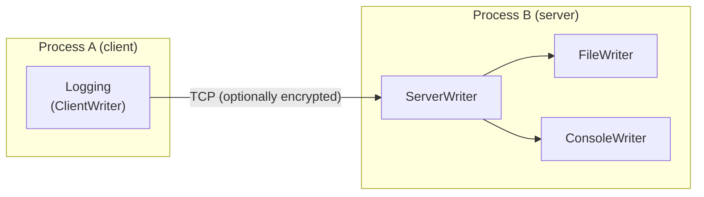

# Network Logging

fastlogging supports network logging via a client-server architecture. A `Logging` instance can act as a server (listening for connections) by including a `ServerConfig`, and another `Logging` instance can act as a client by including a `ClientWriterConfig`.

## Server setup

```java
public static class ServerConfig {
    public ServerConfig(int level, String address, int port)
    public ServerConfig(int level, String address, int port, EncryptionMethod method, String key)
}
```

- `level` — log level filter
- `address` — listening IP address (e.g. "127.0.0.1")
- `port` — listening port
- `method` — `EncryptionMethod.NONE`, `.AuthKey`, `.AES`
- `key` — encryption key string (null for NONE)

Example:

```java
ConsoleWriterConfig console = new ConsoleWriterConfig(FastLogging.DEBUG, true);
FileWriterConfig file = new FileWriterConfig(FastLogging.DEBUG, "/tmp/server.log");
ServerConfig server = new ServerConfig(FastLogging.DEBUG, "127.0.0.1", 12345);
Logging loggingServer = new Logging(FastLogging.DEBUG, "LOGSRV", console, file, server);
loggingServer.syncAll(5.0);
String address = loggingServer.getServerAddress();
```

## Client setup

```java
public static class ClientWriterConfig {
    public ClientWriterConfig(int level, String address, int port)
    public ClientWriterConfig(int level, String address, int port, EncryptionMethod method, String key)
}
```

- `level` — log level filter
- `address` — target IP address
- `port` — target port
- `method` — encryption method
- `key` — encryption key string

Example:

```java
ClientWriterConfig client = new ClientWriterConfig(FastLogging.DEBUG, "127.0.0.1", 12345);
Logging loggingClient = new Logging(FastLogging.DEBUG, "LOGCLIENT", client);
loggingClient.info("Hello over the network");
loggingClient.syncAll(1.0);
loggingClient.shutdown();
```

## Encrypted communication

Use `EncryptionMethod.AES` or `EncryptionMethod.AuthKey` with a key string. Pass the same key to both server and client.

Example:

```java
String key = "my-secret-key";
ServerConfig server = new ServerConfig(FastLogging.DEBUG, "127.0.0.1", 12345, EncryptionMethod.AES, key);
// ...
String authKey = loggingServer.getServerAuthKey();
ClientWriterConfig client = new ClientWriterConfig(FastLogging.DEBUG, "127.0.0.1", 12345, EncryptionMethod.AES, authKey);
```

Note: `getServerAuthKey()` returns the key as a `String`. Use it to pass the key to clients.

## Key types

- `EncryptionMethod.NONE` (0) — no encryption
- `EncryptionMethod.AuthKey` (1) — authentication only
- `EncryptionMethod.AES` (2) — full AES encryption

## Architecture



## Server query methods (on Logging)

- `ServerConfig getServerConfig()` — get server config
- `String getServerAddress()` — get server address
- `String getServerAuthKey()` — get server auth key
- `String getConfigString()` — get complete config as string
