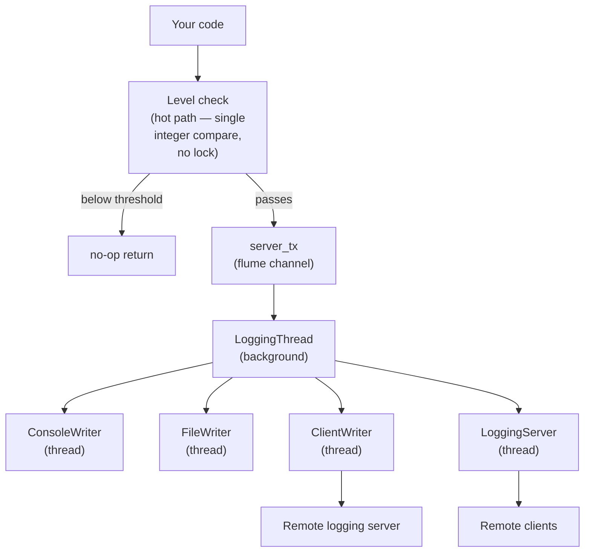

# jfastlogging (JNI) — Documentation

Java bindings for the fastlogging Rust logging library via JNI (Java Native Interface). Messages are routed through an asynchronous background thread to one or more independent writers (console, file, network client/server), keeping the hot path cheap.

## Table of Contents

- [DEF.md](DEF.md) — Constants, enums, and config class definitions
- [LEVELS.md](LEVELS.md) — Log level reference
- [LOGGING.md](LOGGING.md) — The `Logging` class (main entry point)
- [LOGGER.md](LOGGER.md) — The `Logger` inner class
- [WRITERS.md](WRITERS.md) — Writer configuration classes
- [NETWORK.md](NETWORK.md) — Client and server networking
- [CONFIG.md](CONFIG.md) — Extended formatting configuration
- [EXAMPLES.md](EXAMPLES.md) — End-to-end usage examples

## Quick Start

### Build

The native library is built with Rust/Cargo and wired into the Java side via Make targets in `jfastlogging-jni/`.

#### 1. Build the JNI shared library

```sh
cargo build --release
```

Run from the repo root or from `jfastlogging-jni/`. This produces `target/release/libjfastlogging_jni.so`.

#### 2. Copy the library into the Maven project's `lib/` directory under the expected name

   ```sh
   make lib
   ```

   This copies the `.so` to `FastLogging/lib/libjfastlogging.so`.

#### 3. Compile the Java sources

   ```sh
   make java_build
   ```

   This compiles `org/logging/FastLogging.java`.

#### 4. For debug builds, use the debug Make target and a plain (non-release) cargo build

   ```sh
   make lib-debug
   cargo build
   ```

The Java source lives at `jfastlogging-jni/org/logging/FastLogging.java`. The Maven project lives at `jfastlogging-jni/FastLogging/`.

### Minimal Console Example

```java
import org.logging.FastLogging;
import org.logging.FastLogging.ConsoleWriterConfig;
import org.logging.FastLogging.Logging;

public class Main {
    public static void main(String[] args) {
        ConsoleWriterConfig console = new ConsoleWriterConfig(FastLogging.DEBUG, true);
        Logging logging = new Logging(FastLogging.DEBUG, "root", console);
        logging.info("Hello from jfastlogging");
        logging.shutdown();
    }
}
```

## Architecture

All log calls on the hot path do a cheap level check, then hand the message off to a flume channel (`server_tx`). A background `LoggingThread` drains the channel and dispatches to the configured writers, each of which may run on its own thread (file rotation, network client, logging server).



## Important Notes

- **All classes are nested inside `org.logging.FastLogging`.** There is one top-level Java class; every config class, enum, `Logging`, and `Logger` is a static nested class or enum of it.
- **The native library `libjfastlogging.so` must be on `java.library.path`.** It is loaded via `System.loadLibrary("jfastlogging")`; ensure the directory containing the `.so` is passed with `-Djava.library.path=...`.
- **`Logging` constructors take individual writer config objects, not a list.** Each writer is passed as its own parameter (see [LOGGING.md](LOGGING.md) for the full set of overloads).
- **Client-side level filtering happens in Java.** `Logging` methods compare the message level against `instance_level` before invoking JNI, so filtered-out messages never cross the JNI boundary.
- **`Logger` is a non-static inner class** and must be created from a `FastLogging` instance (i.e. you need a `FastLogging` instance to create a `Logger`).
- **Syslog and Callback writers exist in the JNI/Rust layer but do not have Java wrapper classes yet.** Syslog can be partially used via the `Logging(int level, String domain, int syslog)` constructor. The callback writer has no Java wrapper.
